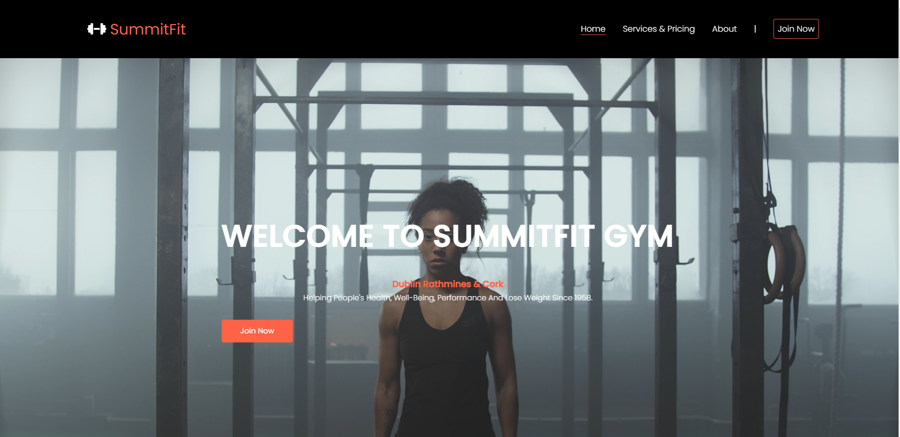
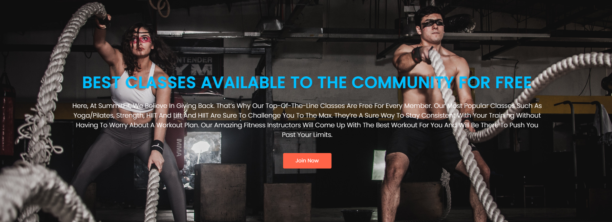
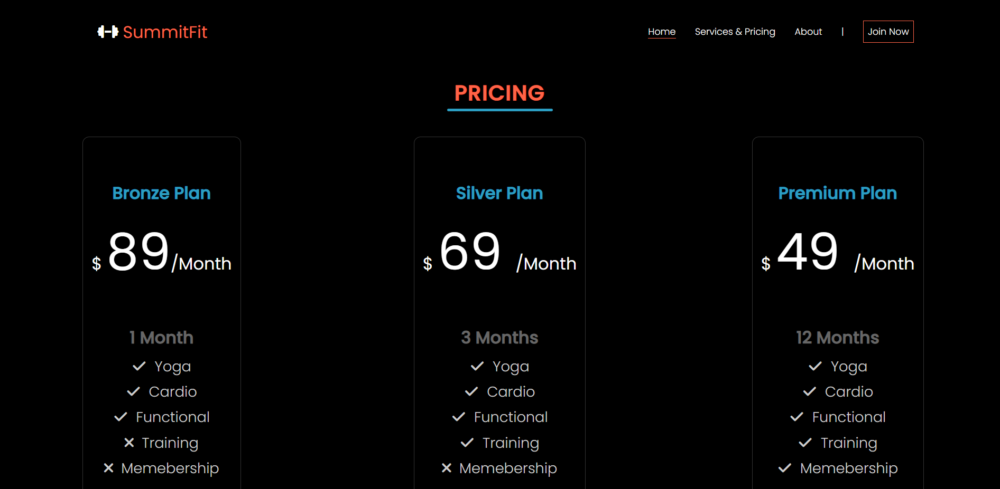
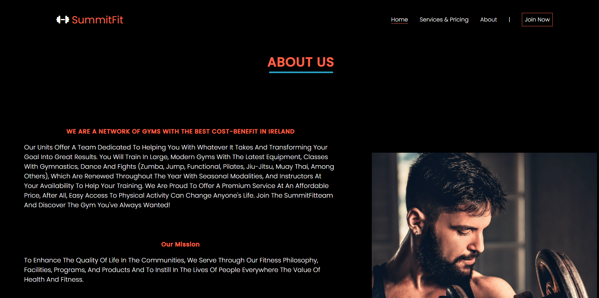
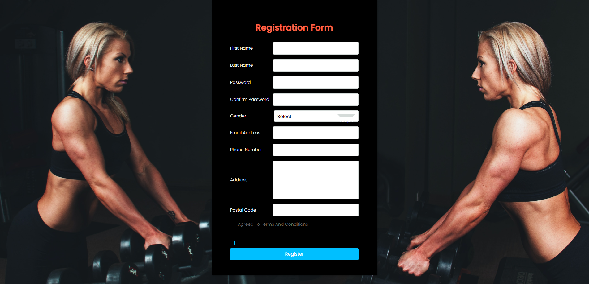

# SummitFit

Summitfit is a gym website focused to audience located in ireland, Dublin and Cork city. This website has been built with the aim to keep users informed about us, our services, pricing and offering an easy way for users to join our club.

Summitfit was born in 2022! Dublin opened in january,2022, followed by the first location outside dublin, and in Cork city in may 2022! 

Summitfit is the first commercial gym to have a heated chamber. The heated chamber is now available in dublin & cork too.

At summitfit we're here to provide a unique environment in which anyone can be comfortable. A diverse, judgement free zone® where a lasting, active lifestyle can be built. 

Our product is a tool, a means to an end; not a brand name or a mold-maker, but a tool that can be used by anyone. In the end, it’s all about you. As we evolve and educate ourselves, we will seek to perfect this safe, energetic environment, where everyone feels accepted and respected. We are not here to kiss your butt, only to kick it if that’s what you need.

     

# Features

The application intends to attract users getting to know SummitFit. Through this application, users can access the HomePage, learn about the Pricing and Services and Join us by completing the Join now form. Below are a brief overview of each page and features.

# Existing Features

## Navigation Bar

The navigation bar is featured on all four pages, the full responsive navigation bar includes links to the Logo, Home page, Services & Pricing page, About us and Join now page and is identical in each page to allow for easy navigation.

The navbar will allow the user to easily navigate from page to page across all devices without having to revert back to the previous page via the ‘back’ button.

* The landing page image
 
The landing page includes welcoming message, a video to grab user's attention with a text overlay to allow users to visualize which audience this website would be applicable to. There is also a call to action button redirecting to the registration form.

     

 
* Reasons to join us section
 
This section will allow the users to learn about reasons to join SummitFit, such as 24 hours gym access, about our excellent structure and how committed our professionals. There is also a call to action button redirectiong to the registration form.

 

    

* The free section 
 
The free section communicates to users some free available classes to members. There is a also weekly totally free classes available to the community to intruduce users SummitFit and our traines. 
 

    

* The Footer
The footer provides users with a consistent point of reference that can be accessed on all pages of the website. The footer contains a copyright notice, social media icons, address and email to sign-up form.
 

    

* Services & Pricing page
 

    

* About us page
 

    

* Join now page
This page includes a registration form where the user will need to complete the form informing personal details such as first name, last name, gender, email address, phone number, address amd postal code.
 

    

# Features Left to Implement

Another feature idea

# Testing

In this section, you need to convince the assessor that you have conducted enough testing to legitimately believe that the site works well. Essentially, in this part you will want to go over all of your project’s features and ensure that they all work as intended, with the project providing an easy and straightforward way for the users to achieve their goals.

In addition, you should mention in this section how your project looks and works on different browsers and screen sizes.

You should also mention in this section any interesting bugs or problems you discovered during your testing, even if you haven't addressed them yet.

If this section grows too long, you may want to split it off into a separate file and link to it from here.

# Validator Testing

* HTML
No errors were returned when passing through the official W3C validator
* CSS
No errors were found when passing through the official (Jigsaw) validator

# Unfixed Bugs
You will need to mention unfixed bugs and why they were not fixed. This section should include shortcomings of the frameworks or technologies used. Although time can be a big variable to consider, paucity of time and difficulty understanding implementation is not a valid reason to leave bugs unfixed.

# Deployment
This section should describe the process you went through to deploy the project to a hosting platform (e.g. GitHub)

The site was deployed to GitHub pages. The steps to deploy are as follows:
In the GitHub repository, navigate to the Settings tab
From the source section drop-down menu, select the Master Branch
Once the master branch has been selected, the page will be automatically refreshed with a detailed ribbon display to indicate the successful deployment.
The live link can be found here - https://code-institute-org.github.io/love-running-2.0/index.html

# Credits

In this section you need to reference where you got your content, media and extra help from. It is common practice to use code from other repositories and tutorials, however, it is important to be very specific about these sources to avoid plagiarism.

You can break the credits section up into Content and Media, depending on what you have included in your project.

# Content
The text for the Home page was taken from Wikipedia Article A
Instructions on how to implement form validation on the Sign Up page was taken from Specific YouTube Tutorial
The icons in the footer were taken from Font Awesome

# Media
The photos used on the home and sign up page are from This Open Source site
The images used for the gallery page were taken from this other open source site
Congratulations on completing your Readme, you have made another big stride in the direction of being a developer!