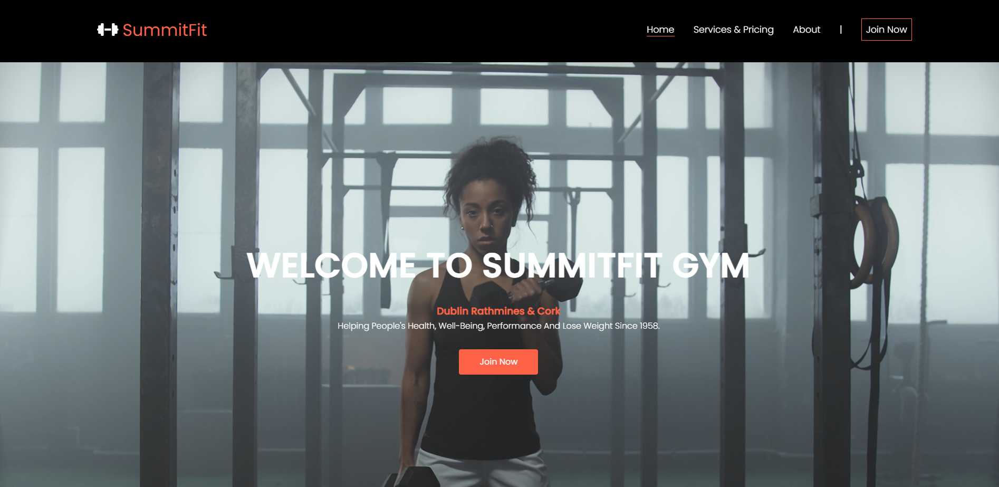

# SummitFit

Summitfit is a gym website focused to audience located in ireland, Dublin and Cork city. This website has been built with the aim to keep users informed about us, our services, pricing and offering an easy way for users to join our club.

It includes a variety of features including internal/external links, images, custom fonts, embedded maps, consistent and detailed page styling, and support for mobile, tablet, and desktop devices.

Summitfit was born in 2022! Dublin opened in january,2022, followed by the first location outside dublin, and in Cork city in may 2022! Summitfit is the first commercial gym to have a heated chamber. The heated chamber is now available in dublin & cork too.

At summitfit we're here to provide a unique environment in which anyone can be comfortable. A diverse, judgement free zone® where a lasting, active lifestyle can be built. 

Our product is a tool, a means to an end; not a brand name or a mold-maker, but a tool that can be used by anyone. In the end, it’s all about you. As we evolve and educate ourselves, we will seek to perfect this safe, energetic environment, where everyone feels accepted and respected. We are not here to kiss your butt, only to kick it if that’s what you need.

     

# Creator

Marcia P Fritzen  
Code Institute Student,
2023

# Features

The application intends to attract users getting to know SummitFit. Through this application, users can access the HomePage, learn about the Pricing and Services and Join us by completing the Join now form. Below are a brief overview of each page and features.

# Existing Features

## Navigation Bar

The navigation bar is featured on all four pages, with the gym name "SummitFit" on the left corner with logo and links to other pages of the website on the right. The links when clicked redirected to the respective pages. The full responsive navigation bar includes links to the Logo, Home page, Services & Pricing page, About us and Join now page and is identical in each page to allow for easy navigation.

The navbar will allow the user to easily navigate from page to page across all devices without having to revert back to the previous page via the ‘back’ button.

* The landing page image
 
1. The landing page in the header section includes h1 heading.

2. Welcoming message using the color white.

3. Video to grab user's attention extracted from pexels.com.

4. A h3 heading to allow users to visualize which audience this website would be applicable to.

5. There is also a call to action button redirecting to the registration form.

     

 
* Reasons to join us section
 
This section will allow the users to learn about reasons to join SummitFit, such as 24 hours gym access, about our excellent structure and how committed our professionals. There is also a call to action button redirectiong to the registration form.

 

    

* The free section 
 
The free section communicates to users some free available classes to members. There is a also weekly totally free classes available to the community to intruduce users SummitFit and our traines. 
 

    

* The Footer
 
The footer provides users with a consistent point of reference/contact information that can be accessed on all pages of the website. The footer contains a copyright notice, link to social media icons (using fontawesome icons), address and email to sign-up to newsletter. The link to social medias redirects to a new tab when clicked.
 

    

* Services & Pricing page
 
This page has been designed to inform pricing and services. It displays three boxes for bronze plan, silver plan and premium plan with the respective prices and services available. There is also a redirecting link to users complete the registration form.

 

    

* About us page
 
The abous us page with a level 1 heading contains information about our history, mission and read more redirect link. There is also an image located on the right side of the screen.
 
 

    

* Join now page
 
This page includes a registration form with another level 3 heading where the user will need to complete the form informing personal details such as first name, last name, gender, email address, phone number, address and postal code in order to sign up for the club. The form contain validation in html, so we cannot submit an empty form or enter a non-email address into an email address field.
 

    

# Features Left to Implement

1. Feature left to implement is a login and admin management page
2. Gallery page
3. Detailed Services page
4. Section in the home page with the instructors name and description.

# Testing

An extensive testing has been conducted and no major issues has been found. 

The sites works at full capacity, user friendly and intuitive. The users can easily navigate and achieve their goals without any trouble. 

The website is fully responsive and works well on different browsers such as Chrome, Firefox and Safari and also on different screem sizes.

The forms available in the website contains validation in html, so there is no way users can submit an empty form or enter a non-email address into an email address field.

I confirmed that the navigation, header, about us, sign up and contact text are all readable and easy to understand.

# Bugs

When I deployed my project on github I found out that the video in the landing page was not working, I discovered this was due to the incorrect path.

Fixed to: https://mpatricia22.github.io/SummitFit/assets/images/video1.mp4 

In CSS, I have experienced some syntax issues. 

 

    

I've also seen many value errors example below.That were fixed during the development stages.

    

You should also mention in this section any interesting bugs or problems you discovered during your testing, even if you haven't addressed them yet.

If this section grows too long, you may want to split it off into a separate file and link to it from here.

# Validator Testing

* HTML
No errors were returned when passing through the official W3C validator
 

    

* CSS
No errors were found when passing through the official (Jigsaw) validator
 

    

* Accessibility
I confirmed that the colors and fonts chosen are easy to ready and accessible by running lighthouse in devtools.
 

    

# Deployment

SummitFit website was deployed to GitHub pages. The deployment steps taken:
1. Access GitHub repository SummitFit
2. Go to the Settings tab
3. From the source section drop-down menu, select the Master Branch
4. Once the master branch has been selected, the page will be automatically refreshed with a detailed ribbon display to indicate the successful deployment.
5. The live link can be found here - https://mpatricia22.github.io/SummitFit/

# Credits

## Content

The icons in the footer were taken from Font Awesome.

## Media
All the photos included on project are from https://www.pexels.com/
